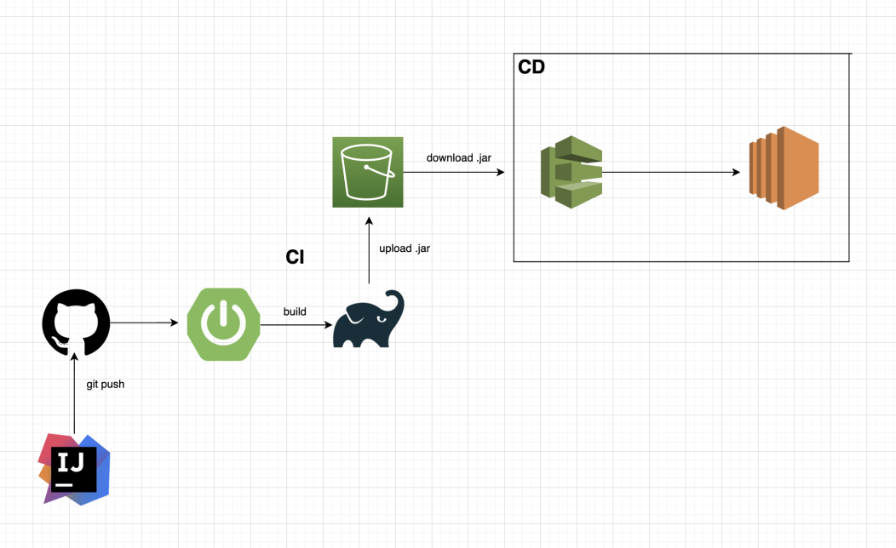
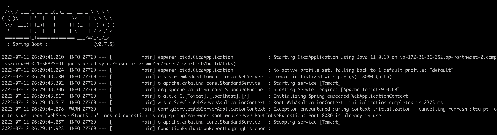

## CI,CD와 필요한 이유

## CI
지속적 통합 Continuous Integration을 의미한다.
  
개발자들이 작업한 코드 변경서항을 자동으로 저장소에 통합하는 프로세스다.

코드 변경사항을 모니터링하고, 변경사힝이 발생할 때마다 자동으로 테스트와 빌드를 수행한다.

### 필요한 이유
CI를 통해 여러 개발자들이 동시에 작업한 코드가 정기적으로 통합되고, 충돌이나 오류를 사전에 발견할 수 있다.

## CD
CD는 지속적 배포(Continuous Deployment)
  
CI를 기반으로 코드 변경사항이 자동으로 테스트 및 빌드된 후, 자동화된 프로세스를 통해 운영 환경으로 배포되는 것을 말한다.
  
### 필요한 이유
CD를 통해 새로운 기능 또는 버그 수정 등의 변경사항이 신속하게 고객에게 전달될 수 있다.
  
 

## Spring Boot CD Architecture

 

## EC2 Spring boot

EC2를 생성해 ssh key를 github와 연결하여 ssh 깃허브 리퍼지토리를 클론
  
`sudo dnf install java-11-amazon-corretto -y`로 jdk 설치
  
그 후 spring boot 프로젝트 디렉터리에서 ./gradlew build로 빌드 파일 생성

cd build/libs로 이동후 `nohup java -jar cicd-0.0.1-SNAPSHOT.jar &`
  
`cat nohup.out` 실행 확인

## CD

- GitHub Action
- AWS CodeDeploy를 사용해 CD를 구성했다.

GitHub Action과 CodeDeploy를 사용한다면 가장 큰 장점은 아무래도 간편하다이지 않을까 싶다.

가장 우리에게 익숙하기 때문이다. 코드 배포 구성을 위한 yml 파일을 작성함으로써 더욱 간편하게 배포를 구성할 수 있다.

깃액션에서는 배포 상태 및 이력을 시각화해 표시할 수 있기 때문에 이를 통해 문제가 발생한 경우 신속하게 대응할 수 있다.
